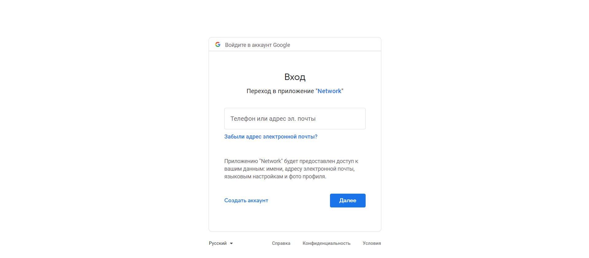
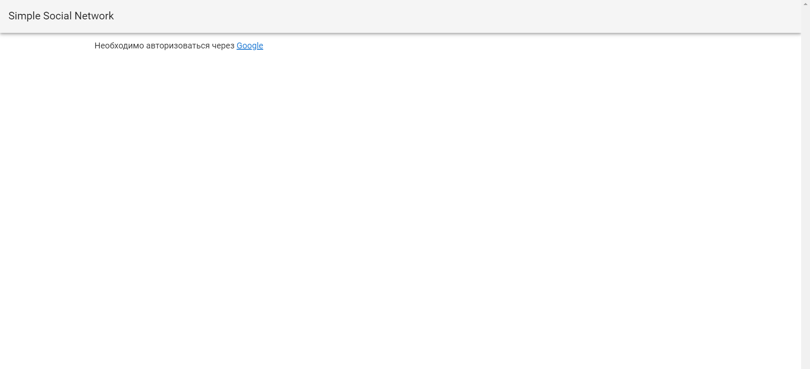
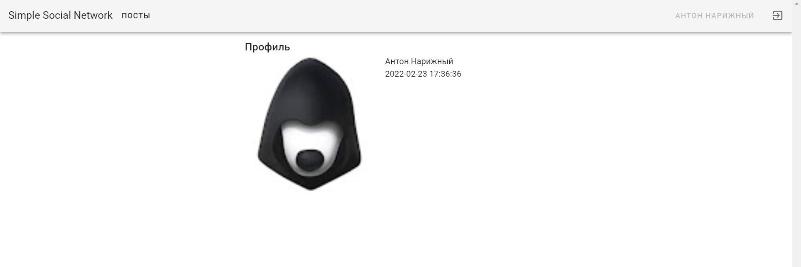
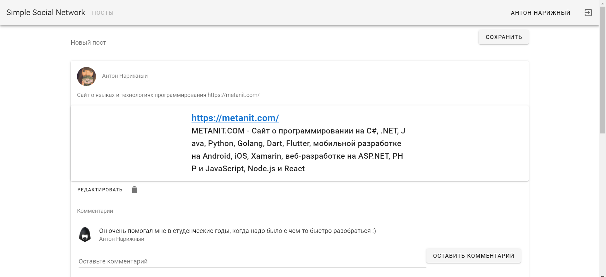
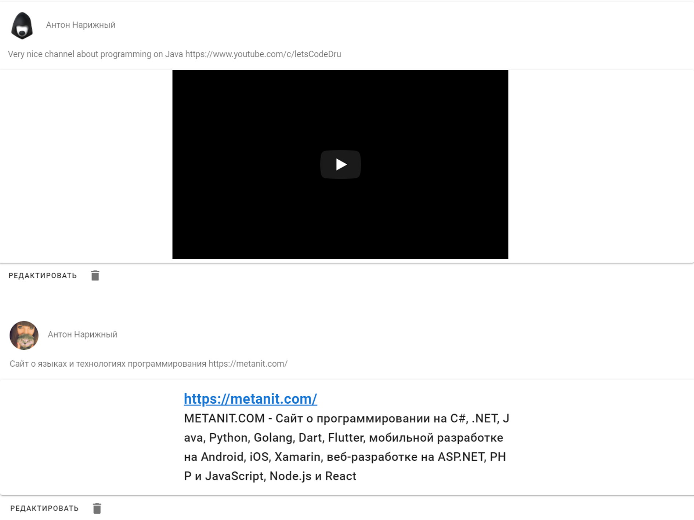
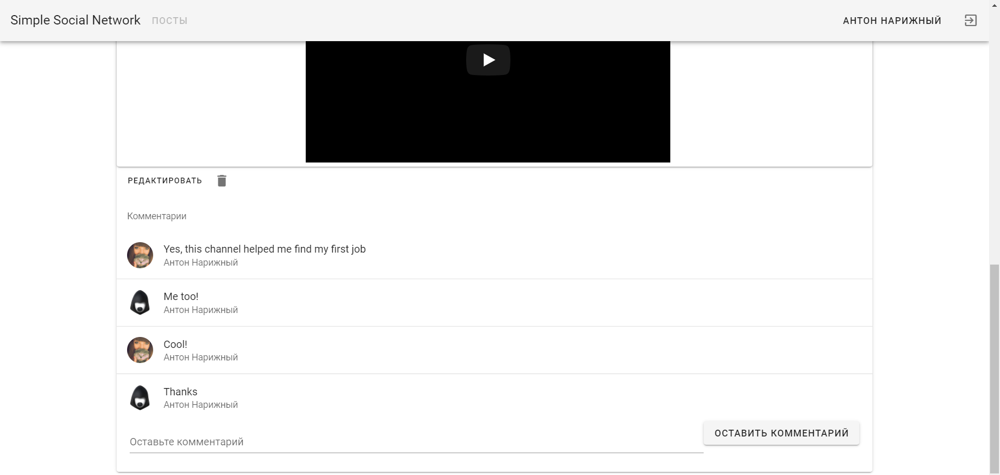

# Simple Social Network

RESTful social network with the following features:
- Google oAuth2 user authentication
- Links preview
- User profiles
- User posts
- User comments on other users posts 
- and also gradual loading of posts when scrolling down the page

## Prerequisites ❗
1. `JDK 11` - for running app
2. `Maven 3.8.1+` - for building package
3. `PostgreSQL` - for data storage

## Preparation 🔨
You need to register your project on [Google Cloud Console](https://console.cloud.google.com) and take credentials (Client Id and Client Secret)
After that, you need to add them to your project configuration with the names clientId and clientSecret respectively.

## Usage
```java
# You need to create database in pgAdmin with the name "network" and enter username and password, if you have different.        

spring.profiles.active=dev

# Spring Data JPA properties
spring.datasource.url=jdbc:postgresql://localhost/network
spring.datasource.username=postgres
spring.datasource.password=admin
spring.jpa.generate-ddl=true

spring.jpa.properties.hibernate.jdbc.lob.non_contextual_creation=true

spring.main.allow-bean-definition-overriding=true

# Google OAuth2 properties
security.oauth2.client.clientId=${clientId}
security.oauth2.client.clientSecret=${clientSecret}
security.oauth2.client.accessTokenUri=https://www.googleapis.com/oauth2/v4/token
security.oauth2.client.userAuthorizationUri=https://accounts.google.com/o/oauth2/v2/auth
security.oauth2.client.clientAuthenticationScheme=form
security.oauth2.client.scope=openid,email,profile
security.oauth2.resource.userInfoUri=https://www.googleapis.com/oauth2/v3/userinfo
security.oauth2.resource.preferTokenInfo=true

# Spring Session properties
spring.session.jdbc.initialize-schema=always
spring.session.jdbc.table-name=SPRING_SESSION
spring.session.jdbc.schema=classpath:session_tables.sql
```
### **Technologies that were used**:
* Java
* Spring Framework (Core, Boot, Web, Data, Security)
* PostgreSQL
* Maven
* Lombok
* Jackson











